# Shattered Pixel Dungeon

A Roguelike RPG, with randomly generated levels, items, enemies, and traps! Based on the [source code of Pixel Dungeon](https://github.com/00-Evan/pixel-dungeon-gradle), by [Watabou](https://www.watabou.ru).

Shattered Pixel Dungeon currently compiles for Android and desktop platforms. It is available from [GitHub](https://github.com/00-Evan/shattered-pixel-dungeon/releases), [Google Play](https://play.google.com/store/apps/details?id=com.shatteredpixel.shatteredpixeldungeon), [Amazon](https://www.amazon.com/Shattered-Pixel-Dungeon/dp/B00OH2C21M), and [F-Droid](https://f-droid.org/repository/browse/?fdid=com.shatteredpixel.shatteredpixeldungeon).

If you like this game, please consider [supporting me on Patreon](https://www.patreon.com/ShatteredPixel)!

There is an official blog for this project at [ShatteredPixel.com](http://www.shatteredpixel.com).

The game also has a translation project hosted on [Transifex](https://www.transifex.com/shattered-pixel/shattered-pixel-dungeon/).

Note that **this repository does not accept pull requests!** The code here is provided in hopes that others may find it useful for their own projects, not to allow community contribution. Issue reports of all kinds (bug reports, feature requests, etc.) are welcome.

If you'd like to work with the code, you can find the following guides in `/docs`:
- [Compiling for Android.](docs/getting-started-android.md)
    - **[If you plan to distribute on Google Play please read the end of this guide.](docs/getting-started-android.md#distributing-your-apk)**
- [Compiling for desktop platforms.](docs/getting-started-desktop.md)
- [Recommended changes for making your own mod.](docs/recommended-changes.md)

    
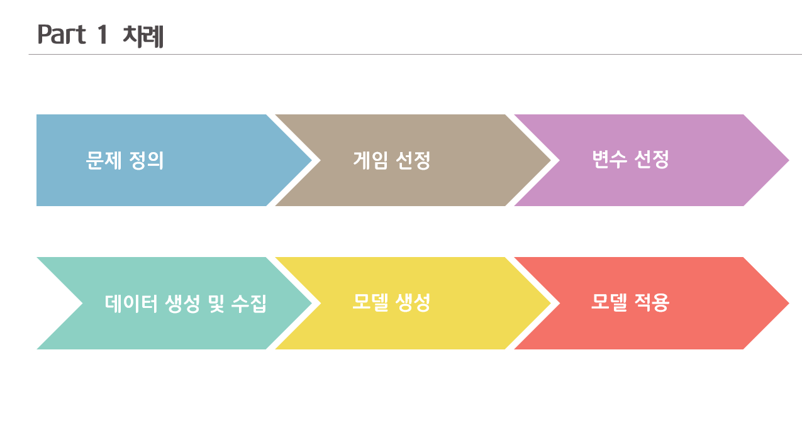    
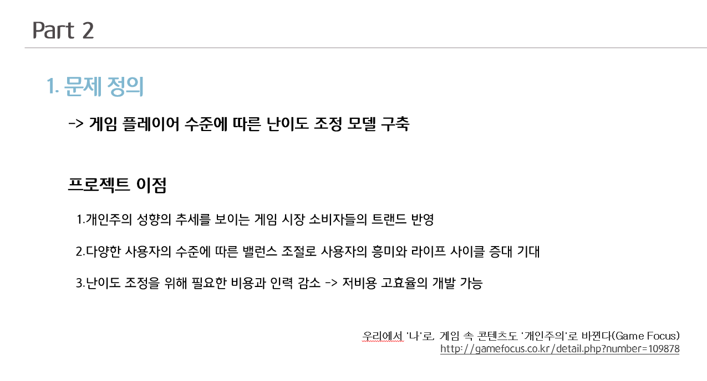    
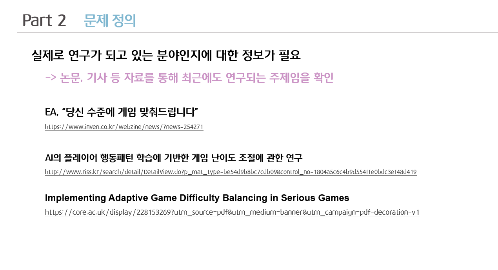    
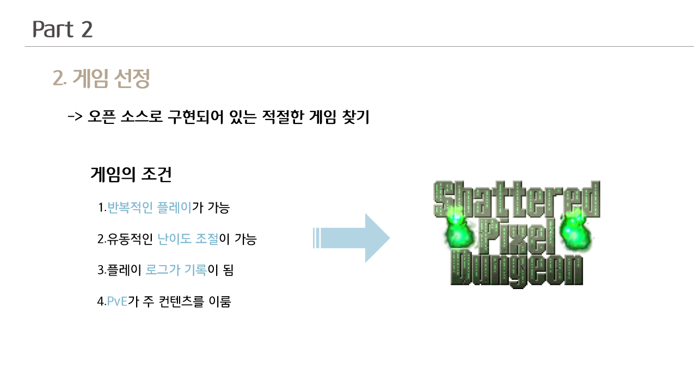    
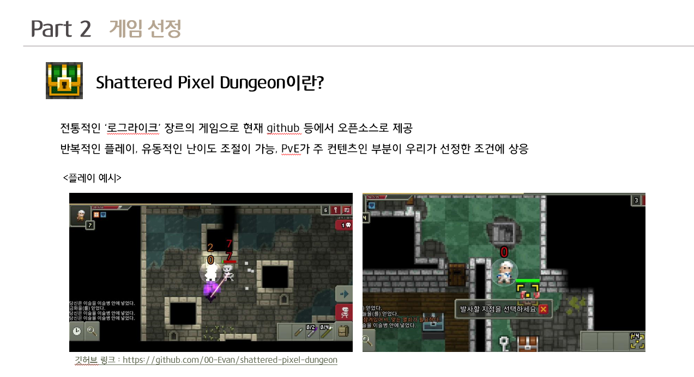    
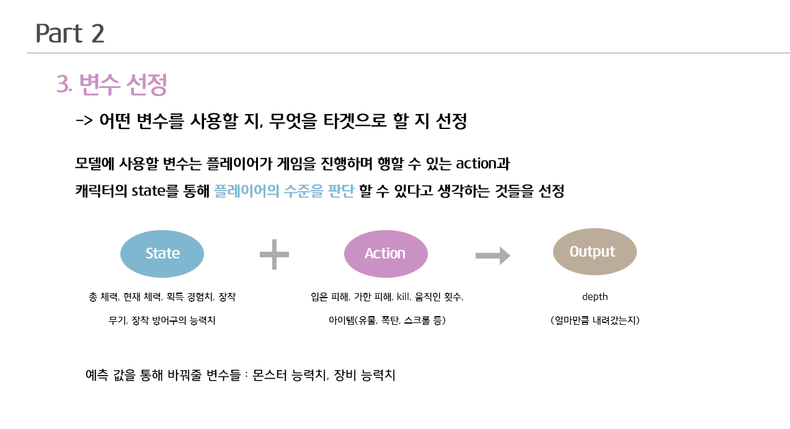    
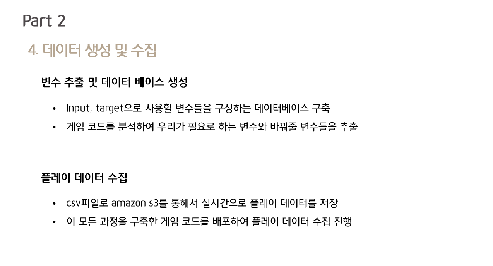    
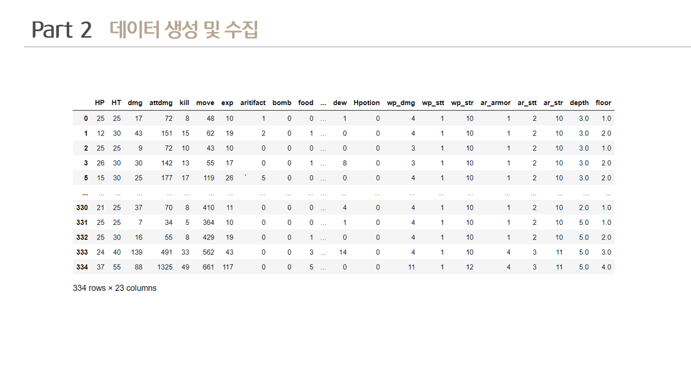    
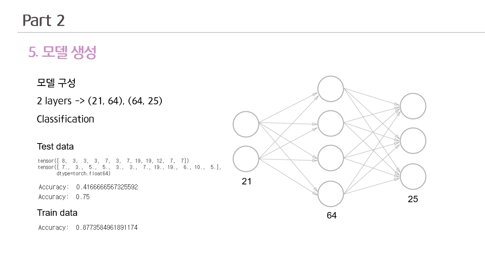    
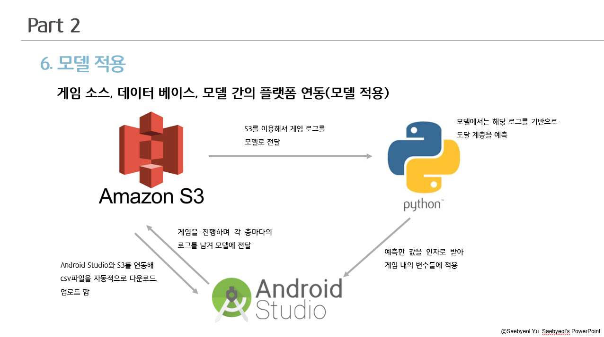    
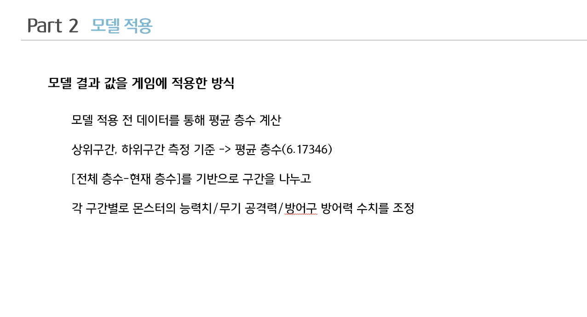    
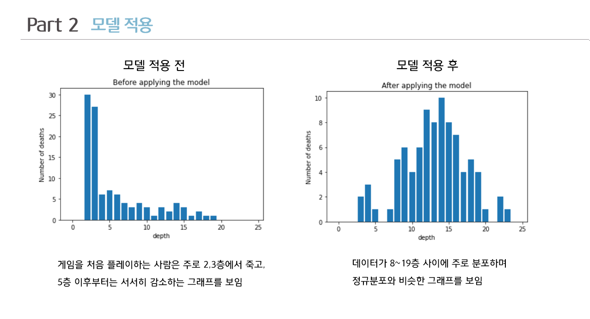    
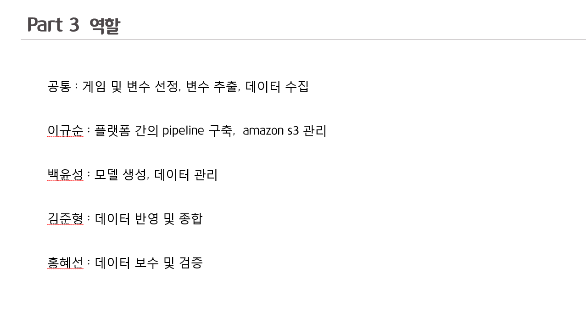    
    
